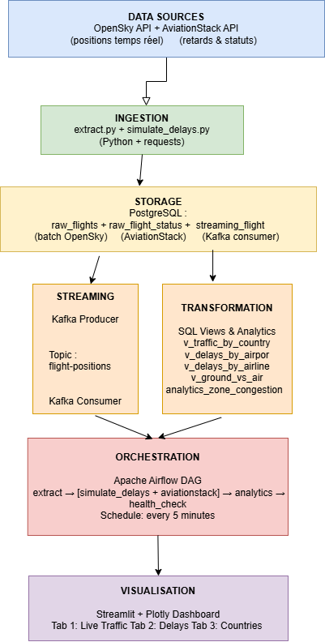

# ✈️ Flight Pipeline — European Air Traffic Analysis

A complete end-to-end data pipeline for real-time analysis of European air traffic performance and delays.

**Course:** ETL & Pipeline Orchestration | ESILV MSc A4 | MACSIN4A2125  
**Author:** Ekta Mistry 
**Professor:** Murali Krishna MOPIDEVI

---

## 🎯 Use Case

How can we analyze in real-time the operational performance of European airports, identify delay patterns, and detect congestion across the European air network?

This pipeline ingests live flight data from OpenSky Network and AviationStack, processes it through a complete ETL/ELT stack, streams it through Kafka, orchestrates it with Airflow, and exposes it on a live Streamlit dashboard.

---

## 🏗️ Architecture

| Layer | Tools |
|---|---|
| Ingestion | Python, requests, OpenSky API, AviationStack API |
| Storage | PostgreSQL |
| Transformation | SQL Views, Aggregations |
| Streaming | Apache Kafka, Python Producer/Consumer |
| Orchestration | Apache Airflow |
| Visualisation | Streamlit, Plotly |
| Infrastructure | Docker Compose |

---

## 📡 Data Sources

| Source | Data | Frequency |
|---|---|---|
| OpenSky Network | GPS positions, altitude, velocity, callsign | Every 2 minutes |
| AviationStack | Schedules, delays, flight status, airlines | Every 1 hour |
| Delay Simulator | Realistic delays based on real flights | Every Airflow run |

---

## 📊 Dashboard

The Streamlit dashboard exposes 8 visualisations across 3 tabs:

**Tab 1 — Live Traffic**
- Real-time flight map over Europe
- Airport saturation (planes on ground)
- French traffic evolution (last 24h)

**Tab 2 — Delay Analysis**
- Average delay by departure airport
- Top airlines by average delay
- Flight status distribution (on time / delayed / cancelled)

**Tab 3 — Country Analysis**
- Top 15 countries by traffic volume
- Ground vs airborne flights (Kafka stream)

---

## 🗂️ Project Structure
flight-pipeline/

├── docker-compose.yml       # All services configuration

├── .env                     # Credentials (not committed)

├── sql/

│   └── init.sql             # Database schema & views

├── etl/

│   ├── extract.py           # Batch ETL (OpenSky + AviationStack)

│   └── simulate_delays.py   # Delay simulator

├── streaming/

│   ├── producer.py          # Kafka producer

│   └── consumer.py          # Kafka consumer

├── dags/

│   └── flight_dag.py        # Airflow DAG

└── dashboard/

└── app.py               # Streamlit dashboard

---

## 🔗 Links

- **Dashboard:** http://localhost:8501
- **Airflow:** http://localhost:8081
- **GitHub:** https://github.com/[your-username]/flight-pipeline